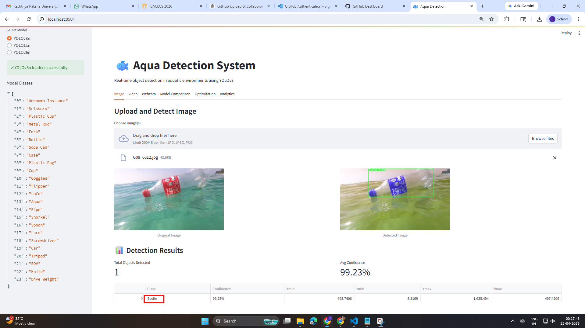

# 🌊 Real-Time Aquatic Debris Detection using YOLOv8

🚀 A Deep Learning-based system for detecting aquatic debris and underwater objects in real-time using YOLOv8.

---

## 📌 Overview

This project presents a **real-time object detection system** designed for marine and underwater environments. It uses the powerful **YOLOv8 (Medium variant)** model to detect and classify various types of aquatic debris and objects.

The system helps in:

* 🌍 Environmental Monitoring
* ⚓ Marine Safety
* 🐠 Ecosystem Protection
* 🚮 Ocean Cleanup Awareness

---

## ✨ Features

* ✅ Real-time detection (Image / Video / Webcam)
* ✅ Detects 24 different object classes
* ✅ Interactive UI using Streamlit
* ✅ Adjustable Confidence Threshold
* ✅ Adjustable IOU Threshold
* ✅ Fast and optimized YOLOv8 model
* ✅ Works with CPU and GPU

---

## 🖼️ Demo Preview

### 📌 Application Output



---

## 🧠 Model Details

| Model       | Parameters | Speed       | Accuracy                          |
| ----------- | ---------- | ----------- | --------------------------------- |
| YOLOv8n     | 3.2M       | ⚡ Very Fast | ❌ Low                             |
| YOLOv8s     | 11.2M      | ⚡ Fast      | ⚠️ Medium                         |
| **YOLOv8m** | **25.9M**  | ⚖️ Balanced | ✅ **High (Used in this project)** |
| YOLOv8l     | 43.7M      | 🐢 Slow     | 🔥 Very High                      |

---

## 📦 Installation Guide

Follow these steps to set up the project locally:

### 1️⃣ Clone Repository

```bash
git clone https://github.com/nidhidhameliya/aqua-detection.git
cd aqua-detection
```

---

### 2️⃣ Create Virtual Environment

```bash
python -m venv venv
```

---

### 3️⃣ Activate Environment

#### ▶ Windows:

```bash
venv\Scripts\activate
```

#### ▶ Mac/Linux:

```bash
source venv/bin/activate
```

---

### 4️⃣ Install Dependencies

```bash
pip install -r requirements.txt
```

---

## 🚀 Run the Project

```bash
streamlit run app.py
```

👉 After running, open your browser and go to:

```text
http://localhost:8501
```

---

## 🧪 How to Use

### 📷 Image Detection

* Upload an image
* Click detect
* View bounding boxes and confidence scores

---

### 🎥 Video Detection

* Upload a video file
* The system processes frame-by-frame
* Displays detected objects

---

### 📸 Webcam Detection

* Start webcam
* Real-time detection begins instantly

---

## 🎯 Detected Classes

This model detects **24 aquatic objects**, including:

* Bottle 🧴
* Plastic Bag 🛍️
* Metal Rod 🔩
* Goggles 🥽
* Snorkel 🤿
* Knife 🔪
* Car 🚗
* ROV 🚤
* Dive Equipment ⚓
* And more...

---

## ⚙️ Configuration

You can adjust detection settings in the UI:

| Parameter            | Range     | Default |
| -------------------- | --------- | ------- |
| Confidence Threshold | 0.0 – 1.0 | 0.5     |
| IOU Threshold        | 0.0 – 1.0 | 0.45    |

---

## 📁 Project Structure

```
aqua_detection/
│
├── app.py                # Streamlit UI
├── inference.py          # Detection logic
├── train.py              # Model training script
├── requirements.txt      # Dependencies
├── README.md             # Documentation
│
├── YOLO/                 # Model configs
├── runs/                 # Training results
├── models/               # Saved weights (ignored)
```

---

## ⚠️ Important Notes

❌ Large files are NOT included in GitHub:

* Model weights (`.pt`)
* Datasets
* Videos

👉 To run this project, download or add your model manually:

```
yolov8m.pt
```

---

## 🧠 Tech Stack

* Python 🐍
* PyTorch 🔥
* YOLOv8 🎯
* Streamlit 🌐
* OpenCV 📷

---

## 📊 Performance

* ⚡ ~13 FPS (Real-time processing)
* 🎯 High detection accuracy
* 🚀 GPU acceleration supported

---


## 📚 References

* YOLOv8 – Ultralytics
* PyTorch Documentation
* OpenCV Documentation

---

## 👨‍💻 Author

**Nidhi Dhameliya**

---

## ⭐ Future Improvements

* 📱 Mobile App Integration
* 🌐 Web Deployment
* 🤖 Deepfake + Object Detection Combo
* ⚡ Edge Device Optimization

